# Capstone Evidence

##  WIDGET MANAGEMENT

###  ✅ 1. Authenticated CRUD endpoints for widgets; requests without valid auth are rejected

**Completed via tests:**

The following test sends a widget-create request without an authentication
token and confirms it is rejected:

```bash
cd backend
node --test --test-name-pattern="rejects widget creation without a token" tests/widgets.test.js
```

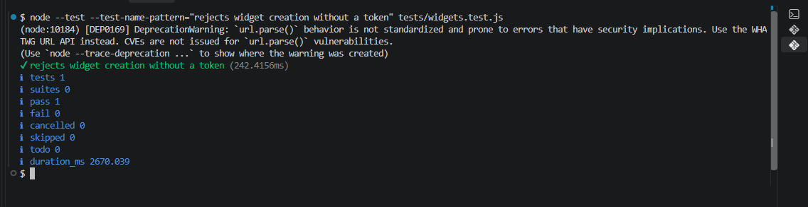

The following authenticated test confirms that the owning tenant can create,
list, and get its widget:

```bash
node --test --test-name-pattern="create + list + get widget for the owning tenant" tests/widgets.test.js
```

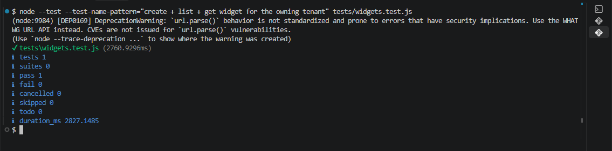

### ✅ 2. Multi-tenant isolation: tenant A cannot read or modify tenant B's widgets or submissions

The screenshots below show that each signed-in tenant sees only its own widgets
and submissions.

**Widget-isolation evidence:**

The first account (`test`) can see its own CTA, popover, and subscribe widgets.
It does not show the demo owner's widgets.

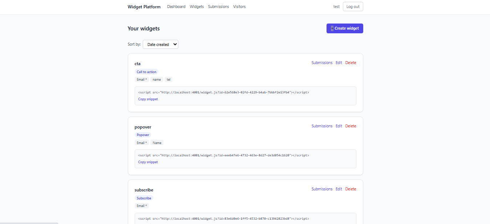

The separate Demo Widgets Co account can see its own demo login, popover, and
CTA widgets. It does not show the `test` account's widgets.

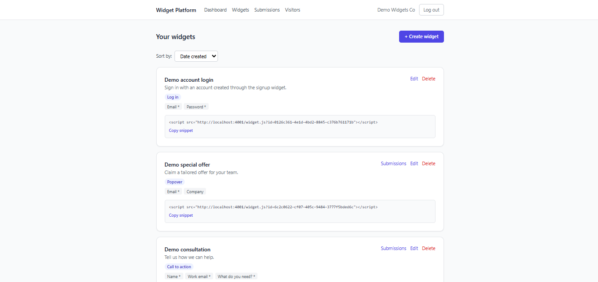


**Public widget rendering and success evidence:**

The **Subscribe to demo account** widget is embedded on the separate Acme
Bakery customer page. The form accepts the visitor's name and email through
the public widget flow.

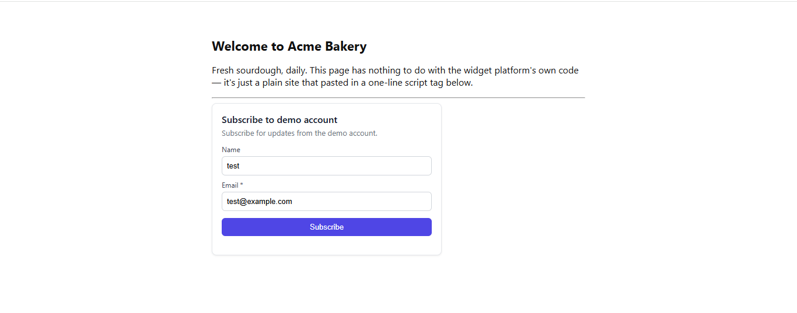

After the visitor submits the form, the widget displays its success message
without leaving the customer page.

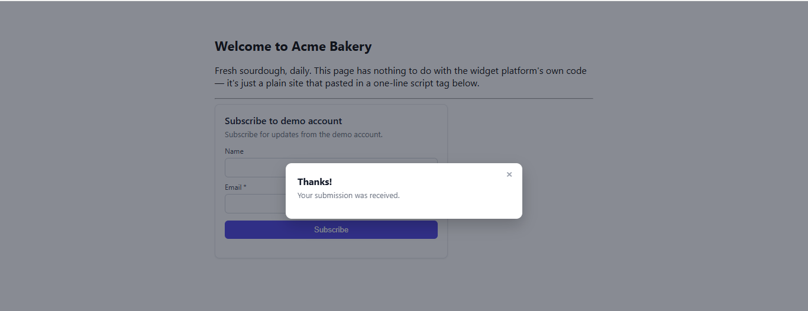

The Demo Widgets Co owner also received a submission through the public
Subscribe to demo account widget. The row is visible within the demo
owner's  submissions page.

The submission from the customer website reaches only the widget owner, which
proves tenant isolation.

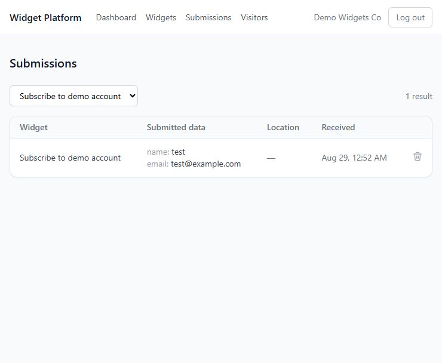

> **Note:** Location is empty during local testing because the website sees the
> device IP as `localhost` (`127.0.0.1`).Geo providers cannot locate a local IP during local testing.
> and the code deliberately skips geo enrichment for local IP addresses while testing locally.

### ✅ 3. Embed snippet generated per widget

**Completed via screenshot:** The Widgets page displays a unique one-line
`<script>` embed snippet for the **Subscribe to demo account** widget. An owner
copies this snippet and pastes it into a customer website to render the widget.

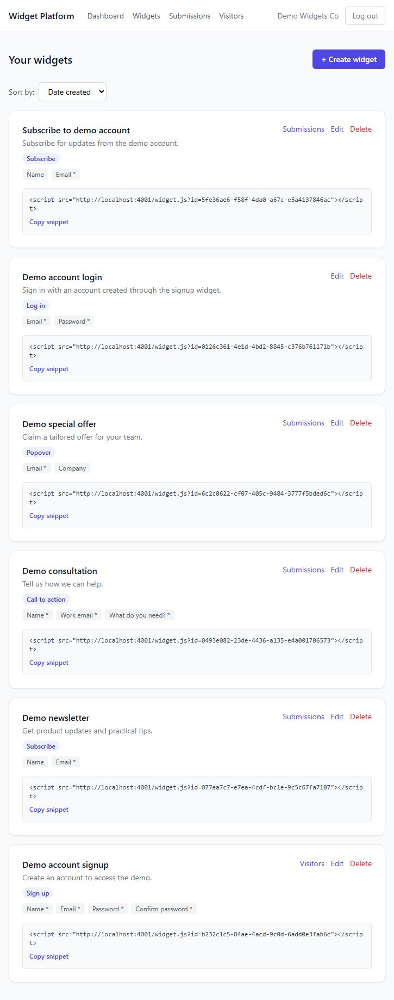


## WIDGET DELIVERY

### ✅ 1. Public config endpoint serves a small payload with correct HTTP cache headers

The public config endpoint returns only the widget configuration and is safe to
call without an owner token. Replace `<WIDGET_ID>` with the ID from the
widget's generated embed snippet. It returns a short-lived cache header:

```bash
PORT=${PORT:-4001}
curl -s -D - -o /dev/null "http://localhost:${PORT}/widgets/<WIDGET_ID>/config"
```

Expected response header:

```text
Cache-Control: public, max-age=60
```
 
This proves the requirement because the public widget configuration response has Cache-Control: max-age=60, so browsers cache it for one minute before checking for updates.

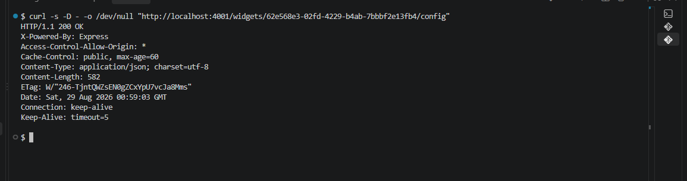

### ✅ 2. Widget JavaScript is served as a versioned bundle (new version = new URL or cache-bust)

> **Note:** This project uses the JavaScript bundle's cache approach, evidenced
> by `Cache-Control: public, max-age=31536000, immutable`.
> Despite using a similar `curl` command, this URL requests JavaScript, while
> `/widgets/<WIDGET_ID>/config` requests widget configuration.

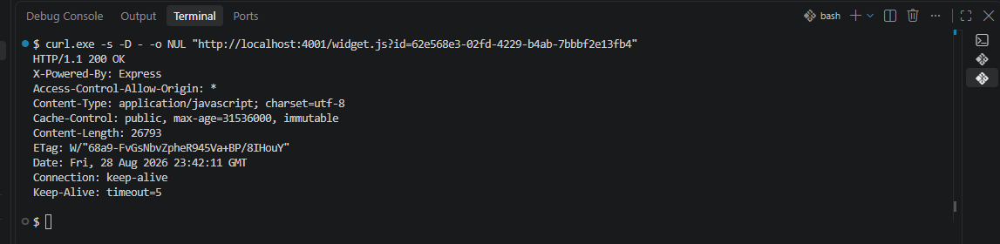

**Evidence via cache headers:** The screenshot shows a JavaScript response
with:

```text
Cache-Control: public, max-age=31536000, immutable
```

This lets browsers cache the JavaScript bundle for one year without requesting
it again. The backend must still be running for the widget to fetch
configuration and submit data.

### ✅ 3. The widget renders on a page served from a different origin than your API

**Completed via screenshot:** The **Subscribe to demo account** widget renders
on the separate Acme Bakery customer page. This customer page is different
from the Widget Platform dashboard and API.


## PUBLIC SUBMISSION API

### ✅ 1. Cross-origin submissions work: CORS headers correct, preflight (`OPTIONS`) handled

**Completed via preflight request:** `OPTIONS /submissions` returns the CORS
headers needed for a cross-origin JSON `POST`.

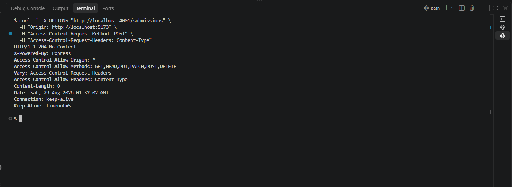

`204` confirms the preflight was handled. The headers allow any development
origin (`*`), `POST`, and the `Content-Type` JSON header. The earlier widget
success screenshot proves the corresponding submission completed.

### ✅ 2. All incoming input validated; malformed and oversized payloads rejected with appropriate 4xx codes and JSON errors

The malformed request returns a `400` JSON error because it omits the required
`widgetId`.

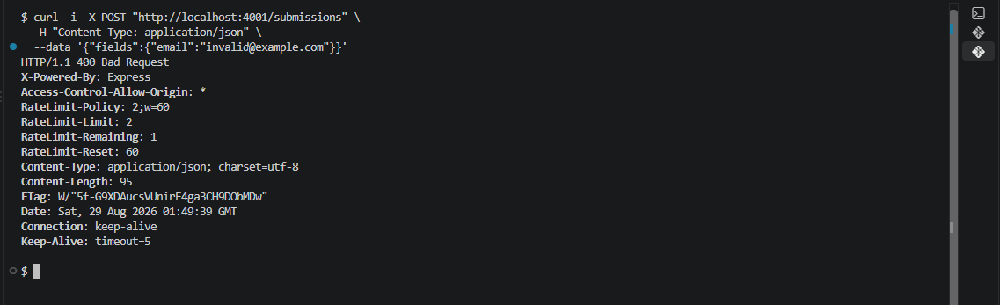

The focused tests confirm that both malformed and oversized payloads are
rejected.

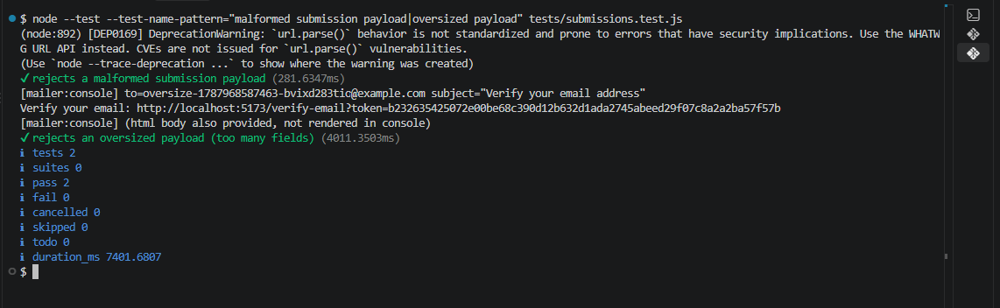

### ✅ 3. Valid submissions stored safely, linked to the right widget and tenant

The owner creates the **Valid Submission Test** widget with Name, Email, and
Telephone number fields.

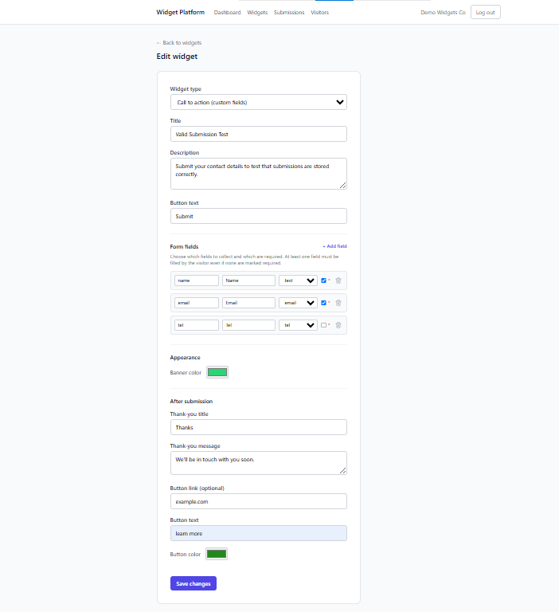

The customer submits those fields through the widget on the customer page.

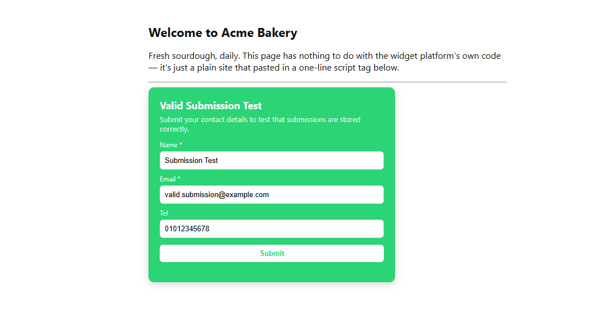

The success message confirms the submission was accepted.

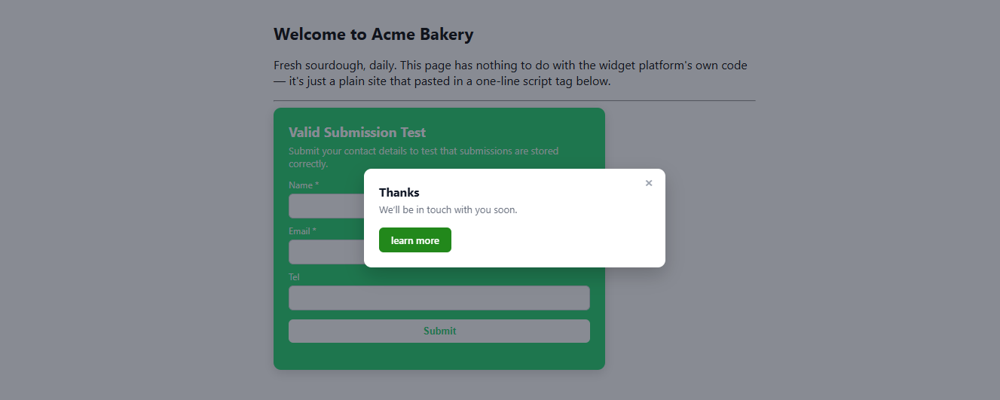

The signed-in owner then sees the saved row on the Submissions page, linked to
the **Valid Submission Test** widget.

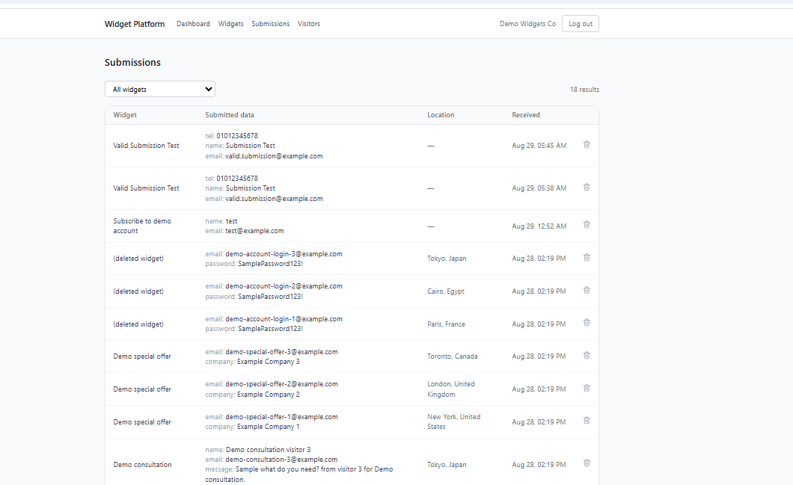


## ABUSE PROTECTION


### ✅ 1. Rate limiting per IP and/or per widget returns `429` under a burst — and the API keeps serving legitimate traffic

The initial valid requests return `201` "two in this case" only the excess
burst requests return `429`, showing that the limiter rejects the flood
without taking the API down.

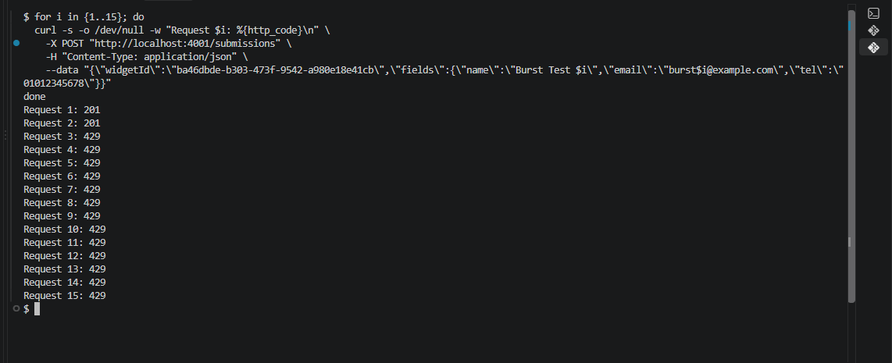

### ✅ 2. At least one spam-prevention technique (honeypot field, token, or heuristic) demonstrably blocks a spam submission

The honeypot test fills the hidden `companyWebsite` field, receives the normal
success status to avoid alerting a bot, and confirms that no submission is
stored.

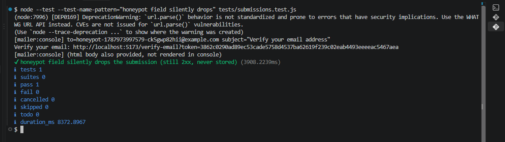

## ENRICHMENT & SAFE SIDE EFFECTS

### ✅ 1. IP→geo enrichment uses a provider fallback chain: provider A down → provider B answers → submission enriched

The focused test makes provider A fail and provider B return the geo result,
then verifies that the submission is enriched with provider B's data.

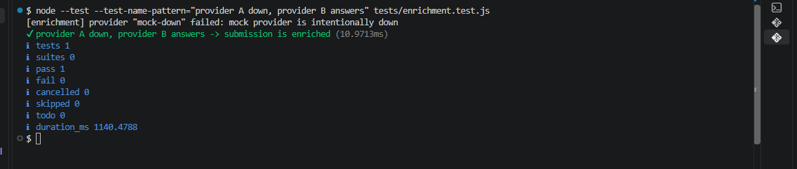

### ✅ 2. All providers down → submission still succeeds (without geo). Degrade, never fail

```bash
cd backend
node --test --test-name-pattern="both providers down" tests/enrichment.test.js
```

The test makes both providers fail and verifies that enrichment returns null
geo data without throwing an error, so submission processing can continue.

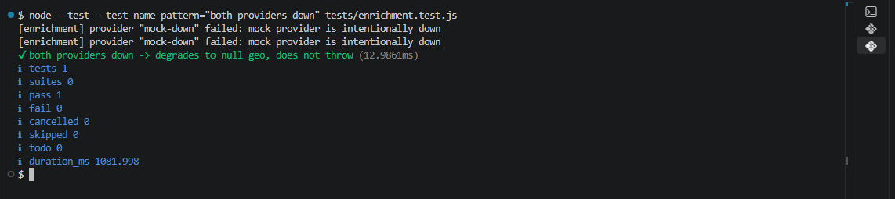

### ✅ 3. A failing confirmation email / webhook does not prevent the submission from being stored

```bash
cd backend
node --test --test-name-pattern="failing confirmation notification" tests/submissions.test.js
```

The test forces notification delivery to fail after storage, then confirms that
the submission remains visible in the owner's dashboard with `notified: false`.

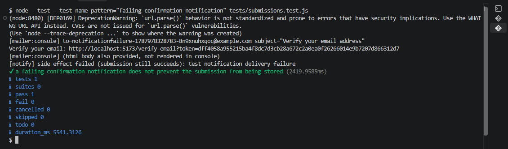

## TESTS & DOCUMENTATION

### ✅ 1. Automated tests cover: CORS preflight, invalid payload, oversized payload, rate limiting, spam control, provider fallback, and successful widget rendering

Run the complete automated test suite as evidence. It contains tests covering
the different aspects of the project:

```bash
cd backend
npm run test
```

### ✅ 2. README with architecture diagram, setup instructions, and API documentation

See the root [README](README.md) for the architecture diagram, setup
instructions, API documentation, and the required submission-pack files.
